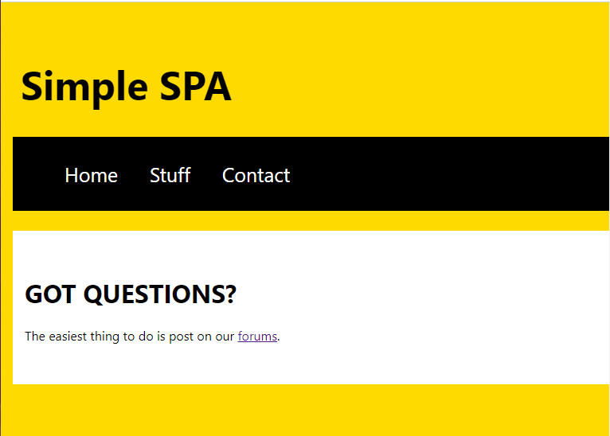

# Simple SPA with Create React App

This project was bootstrapped with [Create React App](https://github.com/facebook/create-react-app).

## Purpose  

The purpose of this project was to make layout of a SPA and create different types of components. App.js shows a normal functional component. Header, Home, and Navbar show arrow functions, and also have been converted to class components.

  
## Appearance

  

## Available Scripts

In the project directory, you can run:

### `npm start`

Runs the app in the development mode.\
Open [http://localhost:3000](http://localhost:3000) to view it in the browser.

The page will reload if you make edits.\
You will also see any lint errors in the console.

